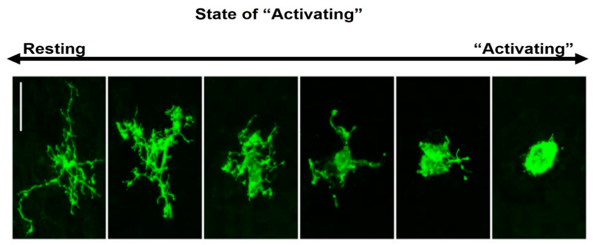
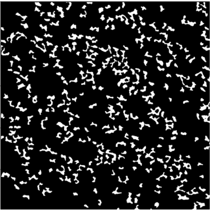
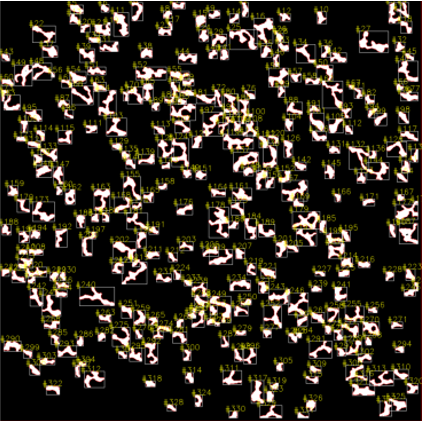
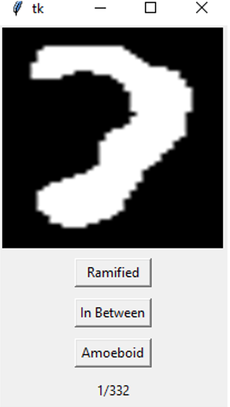

## Project Overview

Macrophages play a vital role in mediating immune responses against pathogens and foreign materials. They display exceptional plasticity in response to environmental stimuli and are able to acquire a spectrum of activation states. The classification of macrophage morphology is an important aspect of investigating macrophage phenotype under different conditions. Therefore, there are significant benefits in developing fast image based approach that enable automated identification of different macrophage functional phenotypes though assessment of cell morphology. This projects aim to develop a platform from which classified macrophage imaging data can be efficiently classified and stored. This will create a solid foundation for the development machine learning algorithms to facilitate high-throughput automated image analysis. 
 

**Figure 1.** Morphological features of ramified and amoeboid macrophage. [Image adapted from [Rawlinson et al, 2020](https://www.mdpi.com/2076-3425/10/3/159/htm)] 

## Project Demonstration

This project requires an input of a binarise image for image processing as shown (Figure 2).

**Figure 2.** Binarise image of macrophage confocal data.
 
 

Input binary images are processed through several morphological operations that **erodes** and **dilates** boundaries to facilitate **Watershed Boundary Detection** (More information on [Watershed Boundary Detection](https://www.pyimagesearch.com/2015/11/02/watershed-opencv/)).  
The detection of individual macrophage boundaries enables segmentation of individual macrophages. This script will draw a bounding box and numerically annotate each segmented macrophage for manual classification as shown below.  
   
  
**Figure 2.** Binarise image with numerically annotated bounding box.
 
 

Individual macrophage datasets are extracted from the image as an array and transferred to a graphic user interface (GUI) for classification. Classified datasets are stored in an array for further analysis.

**Figure 2.** Image classification of subsetted macrophage image data.
 
 

## Required dependencies
1. **Python2.0**
2. **openCV** 
3. **numpy**
4. **matplotlib**
5. **imutils**
6. **Microsoft Windows 10**